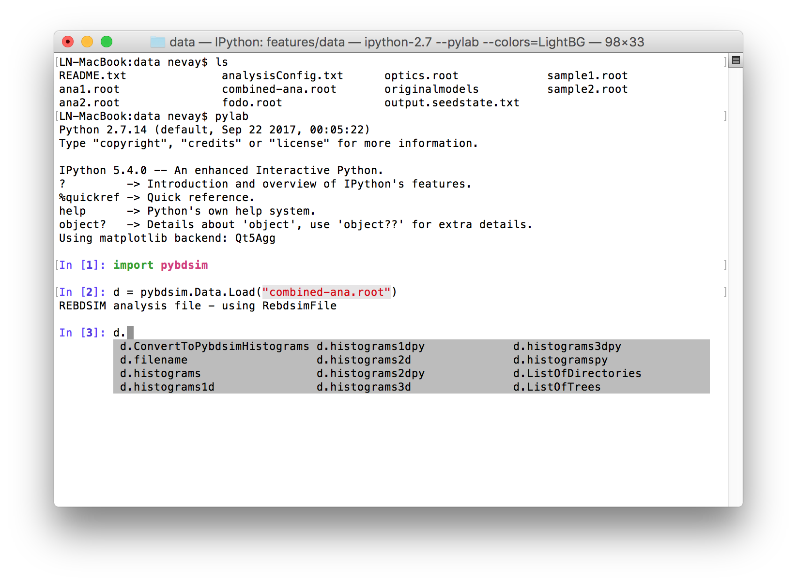
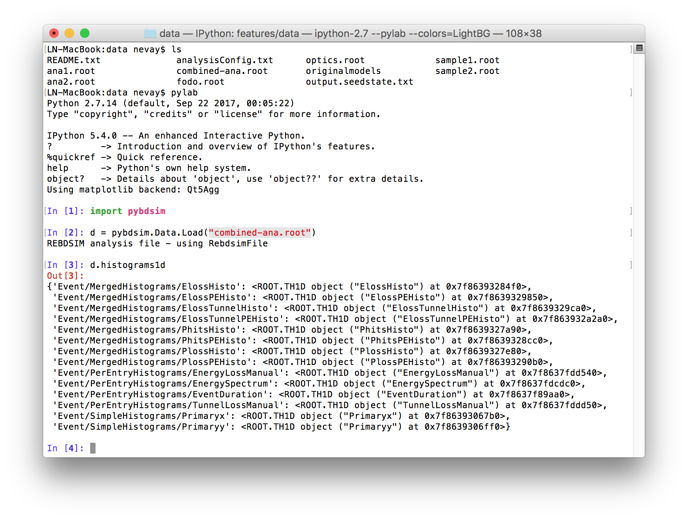
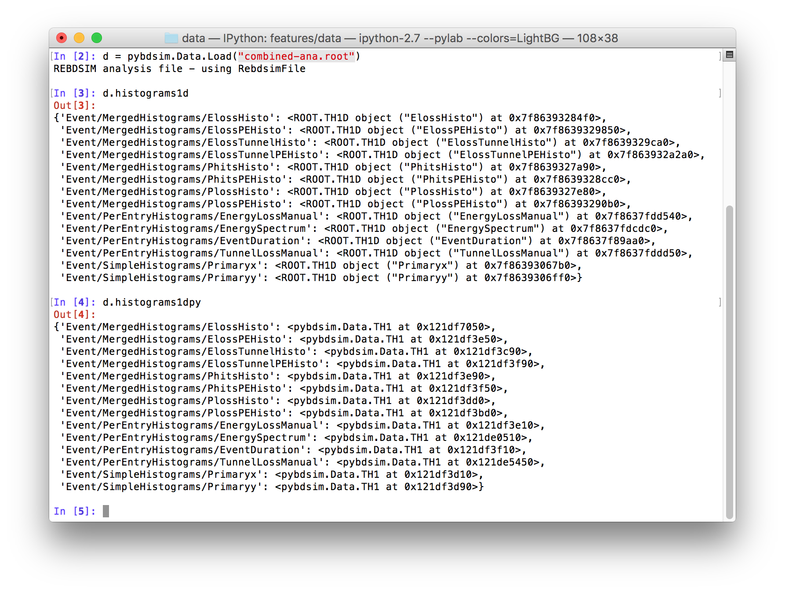
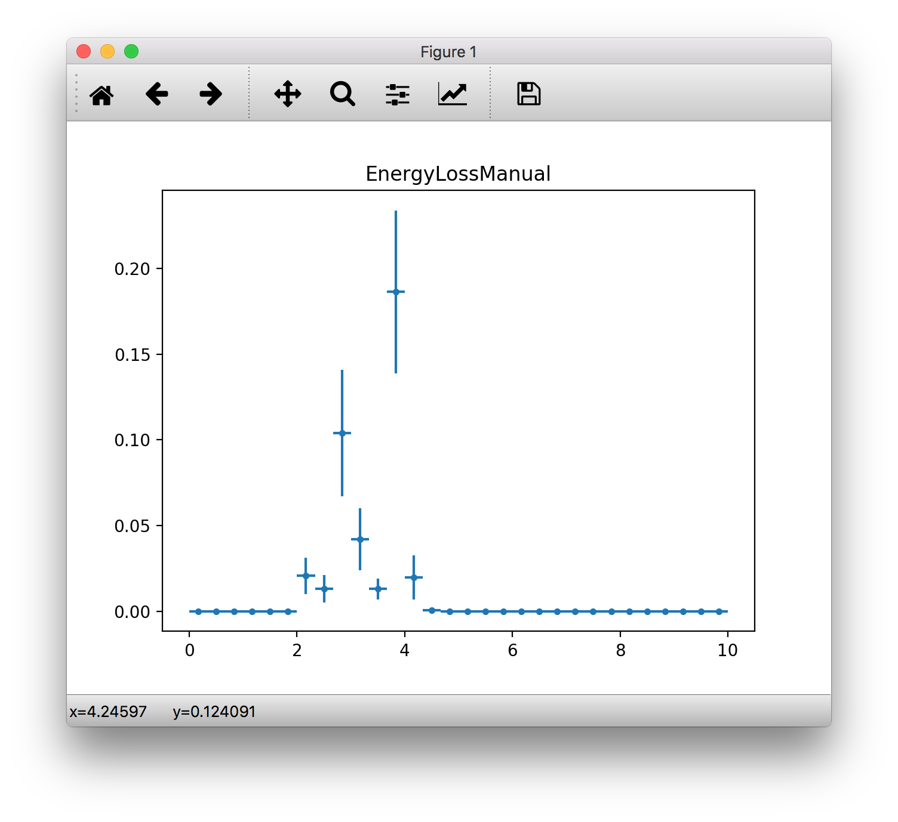

============
Data Loading
============

Utilities to load BDSIM output data. This is intended for optical function plotting
and small scale data extraction - not general analysis of BDSIM output.

Loading ROOT Data
-----------------

pybdsim can load several different ROOT files produce by BDSIM, rebdsim, rebdsimCombine,
bdskim, rebdsimOptics, rebdsimHistoMerge. In all cases, the same function is used
but it may return a different pybdsim class representing the loaded data. ::
  
  >>> d = pybdsim.Data.Load("mylovelyfile.root")

In the case of a `rebdsim` file, an instance of the pybdsim.Data.RebdsimFile class
is returned (See `RebdsimFile`_). In the case of a raw BDSIM output file, an instance
of the BDSIM DataLoader analysis class is returned (even in Python).

.. note:: To load BDSIM raw data, the :code:`<bdsim-install-dir>/bin/bdsim.sh` script
	  must be sourced. This sets up environmental variables that ROOT requires to
	  load our shared libraries in C++ with definitions of the layout of the files
	  (i.e. the C++ classes). See also, :ref:`data-load-manual` for a method to
	  load the libraries yourself (normally automatic with :code:`Load()`).

Looping Over Raw ROOT Data
--------------------------

We can loop over the raw BDSIM data easily with pybdsim. ::

  d = pybdsim.Data.Load("run1.root")
  eventTree = d.GetEventTree()

  for event in eventTree:
      # now we have event.<branchname>.<variable>
      print(event.Eloss.n)

We can also get an index with enumeration: ::

  for i,event in eventTree:
      print(i, event.Eloss.n)

RebdsimFile
-----------

When a `rebdsim` output file is loaded, all histograms will be loaded into a dictionary
with their path inside the root file (i.e. in various folders) as a key. All histograms
are held in a member dictionary called `histograms`. Copies are also provided in
`histograms1d`, `histograms2d` and `histograms3d`.

For convenience we provide wrappers for the raw ROOT histogram classes that provide
easy access to the data in numpy format with simple matplotlib plotting called
`pybdsim.Data.TH1`, `TH2` and `TH3`. Shown below is loading of the example output
file `combined-ana.root` in `bdsim/examples/features/data`.

Histogram Plotting
------------------

Loaded histograms that are wrapped in our pybdsim.Data.THX classes can be plotted::

   >>> pybdsim.Plot.Histogram1D(d.histogramspy['Event/PerEntryHistograms/EnergyLossManual'])

Note, the use of `d.histogramspy` for the wrapped set of histograms and not the raw ROOT
histograms.

.. _data-load-manual:

Manually Loading Raw Data
-------------------------

We can use ROOT direct if you prefer. ::

  import ROOT
  import pybdsim

  pybdsim.Data.LoadROOTLibraries()
  # this imports all of BDSIM's analysis classes and puts them inside ROOT

  # we need to know the BDSIM C++ classes we want by name
  d = ROOT.DataLoader("run1.root")
  # now the same as pybdsim.Data.Load("run1.root")

  model = pybdsim.Data.GetModelForPlotting(d)
  
  

Sampler Data
------------

.. warning:: This is a simplified way of loading sampler data that "flattens" the
	     structure losing all concept of which coordinate belongs to which event.
	     This is not recommend, and this may perhaps not be efficient, but it is
	     occasionally useful. If you want to make a histogram, use rebdsim. Only
	     with this will the error bars be correct.

Sampler data can be trivially extracted from a raw BDSIM output file ::

  >>> import pybdsim
  >>> d = pybdsim.Data.Load("output.root")
  >>> primaries = pybdsim.Data.SamplerData(d)

The optional second argument to `SamplerData` can be either the index of the sampler
as counting from 0 including the primaries, or the name of the sampler. ::

  >>> fq15x = pybdsim.Data.SamplerData(d, fq15x)
  >>> thirdAfterPrimares = pybdsim.Data.SamplerData(d, 3)

A near-duplicate class exists called `PhaseSpaceData` that can extract only the
variables most interesting for tracking ('x','xp','y','yp','z','zp','energy','t'). ::

  >>> psd1 = pybdsim.Data.PhaseSpaceData(d)
  >>> psd2 = pybdsim.Data.PhaseSpaceData(d, fq15x)
  >>> psd3 = pybdsim.Data.PhaseSpaceData(d, 3)
